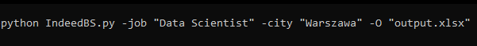
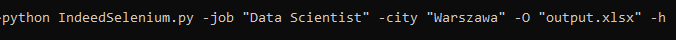

<h2>Beautiful Soup Version</h2>

You can run the script from the command by using

<h3>python IndeedBS.py [optional criteria] -O [output]</h3>

 

Possible Kwargs:

<ul>
  <li><strong>-job</strong> <em>job title</em></li>
  <li><strong>-city</strong> <em>city name</em></li>
  <li><strong>-contract</strong> <em>type of contract</em></li>
  <li><strong>-max</strong> <em>how many job pages to scrape (integer)</em></li>
  <li><strong>-maxold</strong> <em>how old the job posting</em></li>
  <li><strong>-O</strong> <em>outputname.xlsx</em></li>
</ul>
 

</img>

 
<h2>Selenium Version</h2>

You can run the script from the command by using

<h3>python IndeedSelenium.py [optional criteria] -O [output]</h3>

 

Possible Kwargs:

<ul>
  <li><strong>-job</strong> <em>job title</em></li>
  <li><strong>-city</strong> <em>city name</em></li>
  <li><strong>-contract</strong> <em>type of contract</em></li>
  <li><strong>-max</strong> <em>how many job pages to scrape (integer)</em></li>
  <li><strong>-maxold</strong> <em>how old the job posting</em></li>
  <li><strong>-O</strong> <em>outputname.xlsx</em></li>
  <li><strong>-h (or -headless)</strong> <em>to run the script headless</em></li>
</ul>

</img>

<h2>Scrapy Version</h2>

You can run the script from the command by using

<h3>scrapy crawl job_offers [optional criteria] -o [output]</h3>

 

Possible Kwargs:

<ul>
  <li><strong>-job</strong> <em>job title</em></li>
  <li><strong>-city</strong> <em>city name</em></li>
  <li><strong>-contract</strong> <em>type of contract</em></li>
  <li><strong>-maxold</strong> <em>how old the job posting</em></li>
  <li><strong>-o</strong> <em>outputname.csv</em></li>
</ul>

</img>

<h2>Example Filters:</h2>
 
<ul>
  <li><strong>-job: </strong> <em>'Data Scientist'</em></li>
  <li><strong>-city: </strong> <em>'Warsaw'</em></li>
  <li><strong>-contract: </strong> <em>'fulltime', 'permanent', 'subcontract', 'internship', 'parttime'</em></li>
  <li><strong>-max</strong> <em>'10', '50', '100'</em></li>
  <li><strong>-maxold: </strong> <em>'1' (24 hours), '3' (3 days), '7' (7 days), '14' (14 days)</em></li>
  <li><strong>-o: </strong> <em>'job_offers.csv'</em></li>
</ul>
